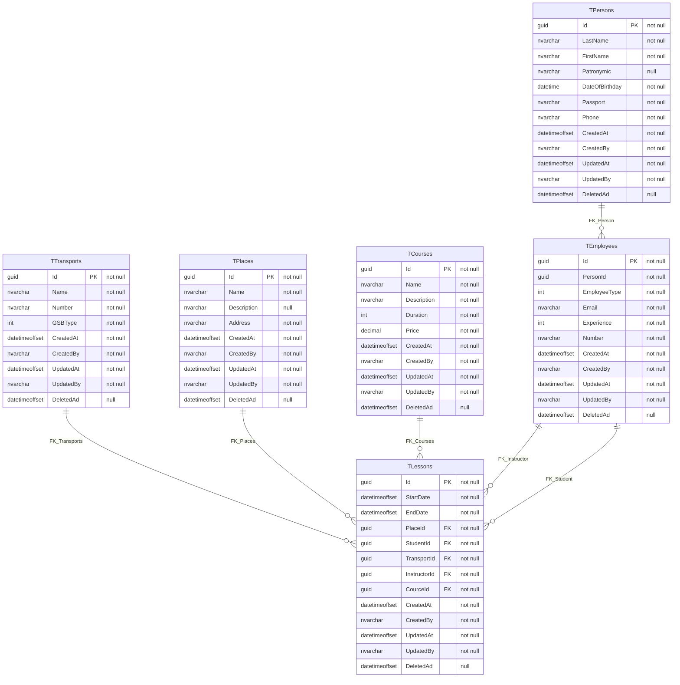

# ERP Driving_School

Данный проект предназначен для автоматизации составления рассписания практических занятий в автошколе.
В проекте присутствует база данных состоящая из следующих таблиц:
  - TTransports - таблица, хрянящаяя в себе данные о транспортных средствах, используемых на занятиях;
  - TPlaces - таблица, хрянящаяя в себе данные о площадках для практических занятий;
  - TCourses - таблица, хрянящаяя в себе данные о курсах обучения, предоставляемых автошколой;
  - TPersons - таблица, хрянящаяя в себе данные о персонах (людях), например ФИО или номер телефона;
  - TEmployees - таблица, хрянящаяя в себе данные о всех работниках автошколы (инструкторов) и обучающихся (студентов);
  - TLessons - таблица, хрянящаяя в себе данные о практических занятиях;
-----

# Ниже представлена ER-диаграмма базы данных:

